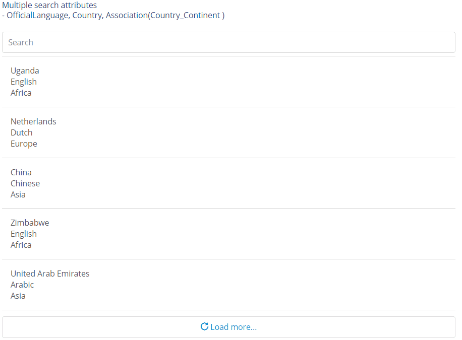
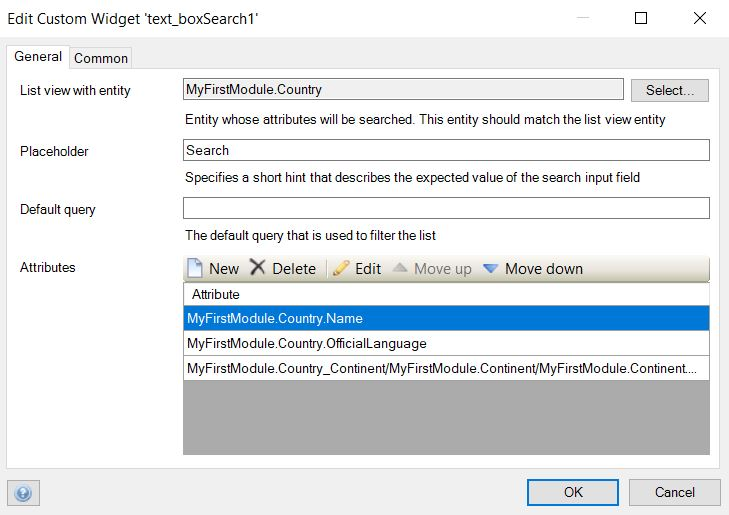
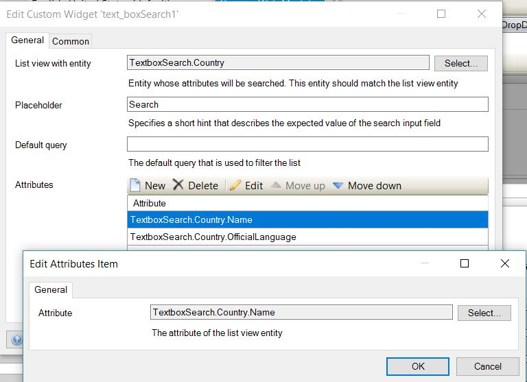
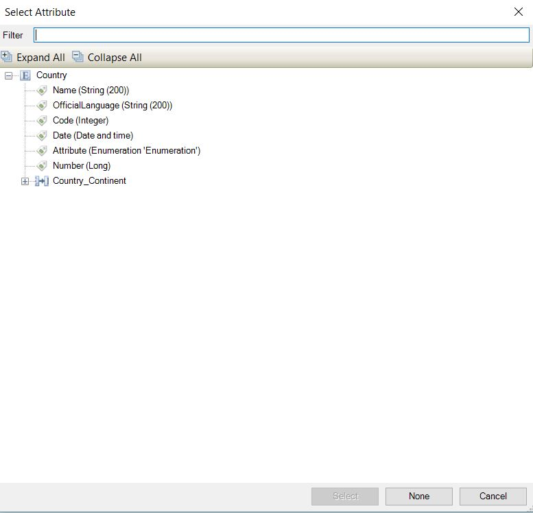

# Text-box search

Add an interactive search box to all of your listview
It supports searching on single field similar to the built-in list view search capabilities.

## Features
* Search through a single field with single and multiple attributes
* Open search in default

## Dependencies
Mendix 7.7.1

## Demo project

[https://textboxsearch.mxapps.io/](https://textboxsearch.mxapps.io/)

## Usage

Configure the widget as below.

- On the `List view with entity` option of the `General` tab, select an entity that matches listview entity.

- On the `Attributes` option of the `General` tab, create attributes to be used in the text search.

## Issues, suggestions and feature requests
Please report issues at [https://github.com/mendixlabs/text-box-search/issues](https://github.com/mendixlabs/text-box-search/issues).

## Development and contribution
Please follow [development guide](/development.md). 